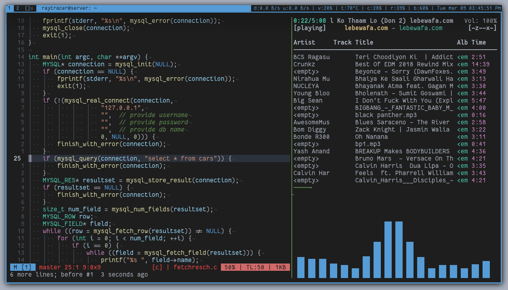
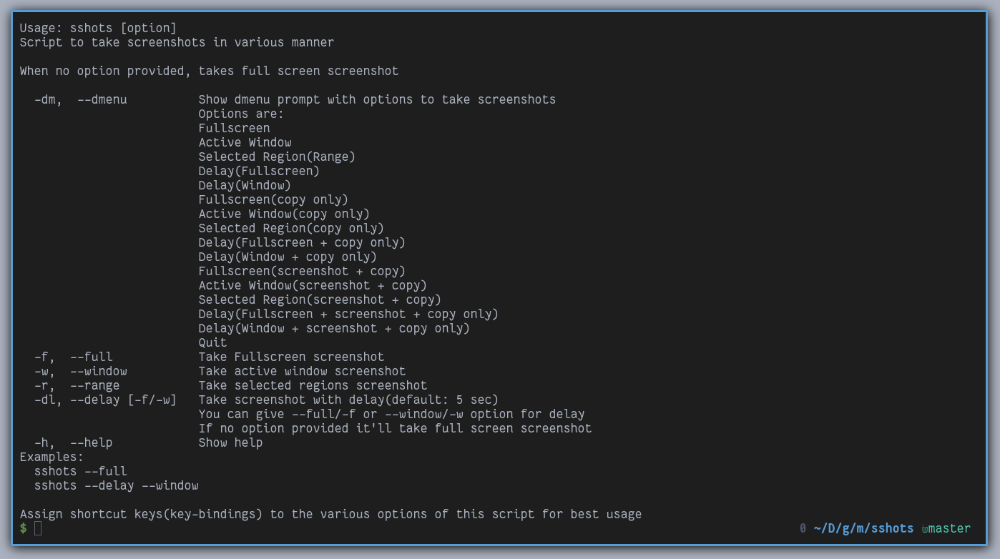
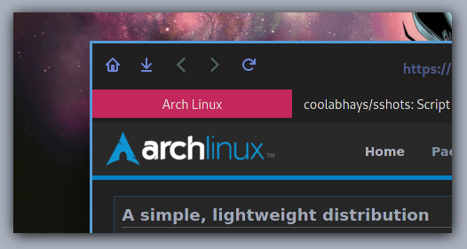
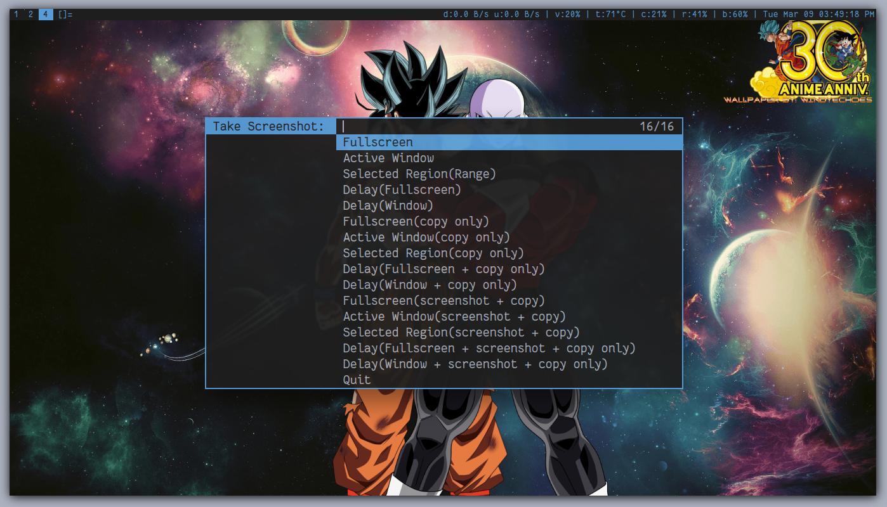

# sshots

Script to take screenshot of your desktop.

## Features:

Following are the features provided by this script:

* Take full screenshot
* Take active window screenshot
* Take selected region screenshot
* Take delayed screenshot
* Copy only the screenshot(for screenshots with no future need)
* Copy and also save the screenshot
* Edit the screenshot to provide it nice look(shadow and custom background)
* Get screenshot preview with notification

## Options:

You can get the all the information with `--help|-h` option. Here are also few other options with previews:

### full window screenshot

To take full window screenshot, use `--full|-f` option

### acitve window screenshot

To take acitve window screenshot, use `--window|-w` option

### selected region screenshot

To take selected region screenshot, use `--range|-r` option

### delayed screenshot

For delayed screenshot, use `--delay|-dl` option. Few things to note here though:

* By-default, delay is set for `5 sec`
* You can provided either `--full|-f` or `--window|-w` option after `--delay|-dl`, to take the respective type of screenshot
* If no option is provided then by-default, it'll take _fullscreen screenshot_ after the time interval

### screenshot with dmenu

Use `--dmenu|-dm` option to get dmenu prompt with all the options supported

Here are the options supported through dmenu prompt:

* Fullscreen
* Active Window
* Selected Region(Range)
* Delay(Fullscreen)
* Delay(Window)
* Fullscreen(copy only)
* Active Window(copy only)
* Selected Region(copy only)
* Delay(Fullscreen + copy only)
* Delay(Window + copy only)
* Fullscreen(screenshot + copy)
* Active Window(screenshot + copy)
* Selected Region(screenshot + copy)
* Delay(Fullscreen + screenshot + copy)
* Delay(Window + screenshot + copy)
* Quit

`copy only` means that it'll not save the screenshot for further use. This is beneficial for quick sharing of screenshot with no future use.

`screenshot + copy` means that it'll copy as well as save the screenshot.

## Dependencies

* `maim` -> screenshot taking utility
* `notification-daemon` -> for taken screenshot previews with notification
* `xdotool` -> to get the active window for screenshot

`NOTE: For better usage, bind this script with options you desire to your keyboard as shortcut.`
